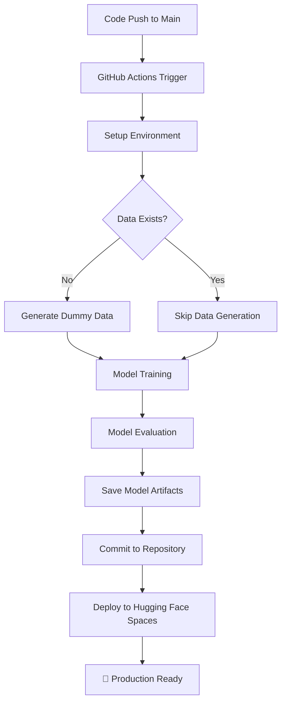

# 🎯 Gamble Comment Detector

<p align="center">
  
  
  
  
  
  
  
</p>

<p align="center">
  <em>An intelligent machine learning system with automated MLOps pipeline for detecting gambling-related content in user comments using natural language processing techniques.</em>
</p>

---

## ✨ Features

- **🤖 Smart Detection**: Advanced ML model trained to identify gambling-related comments with high accuracy
- **⚡ Fast API**: Lightning-fast REST API built with FastAPI for real-time inference
- **🔄 Automated ML Pipeline**: Complete MLOps workflow with GitHub Actions for training, evaluation, and deployment
- **📊 Model Evaluation**: Comprehensive evaluation metrics and performance monitoring with automated reporting
- **🚀 Auto-Deployment**: Seamless deployment to Hugging Face Spaces with every model update
- **🛠️ Development Tools**: Complete pipeline with training, evaluation, and inference capabilities
- **📈 Scalable Architecture**: Modular design supporting easy model updates and improvements

---

## 🔄 Automated ML Pipeline (MLOps)

This project implements a complete **MLOps pipeline** using GitHub Actions that automatically handles the entire machine learning lifecycle:

### 🏗️ Pipeline Architecture



### ⚙️ Pipeline Stages

| Stage | Description | Tools Used |
|-------|-------------|------------|
| **🔧 Environment Setup** | Python 3.9, dependencies installation | `setup-python@v4`, `pip` |
| **📊 Data Management** | Auto-generate dummy data if missing | Custom Python script |
| **🏋️ Model Training** | Train ML model with latest data | `scikit-learn`, `joblib` |
| **📈 Model Evaluation** | Generate performance metrics and reports | Custom evaluation script |
| **💾 Artifact Management** | Version control for model files | Git commits, `upload-artifact@v4` |
| **🚀 Auto Deployment** | Deploy to Hugging Face Spaces | Git LFS, HF Spaces API |

### 🎯 Pipeline Triggers

- **🔄 Automatic**: Every push to `main` branch
- **🎮 Manual**: Workflow dispatch for on-demand runs
- **📅 Scheduled**: Can be configured for periodic retraining

### 🛡️ Pipeline Benefits

- **🔒 Reproducibility**: Consistent environment and versioning
- **⚡ Fast Iteration**: Automated testing and deployment
- **📊 Monitoring**: Built-in evaluation and reporting
- **🔄 Continuous Integration**: Seamless model updates
- **🚀 Zero-Downtime Deployment**: Automatic production updates

---

## 🚀 Quick Start

### Prerequisites

Ensure you have the following installed:
- **Python 3.8+**
- **pip** (Python package manager)

### Installation

1. **Clone the repository**
   ```bash
   git clone https://github.com/minggo-commits/gamble-comment-detector.git
   cd gamble-comment-detector
   ```

2. **Create a virtual environment** (recommended)
   ```bash
   python -m venv venv
   source venv/bin/activate  # On Windows: venv\Scripts\activate
   ```

3. **Install dependencies**
   ```bash
   pip install -r requirements.txt
   ```

### Usage

#### 🔥 Start the API Server
```bash
python app.py
```

The API will be available at `http://localhost:8000`

#### 📝 API Documentation
Once the server is running, visit:
- **Interactive API Docs**: `http://localhost:8000/docs`
- **ReDoc Documentation**: `http://localhost:8000/redoc`

#### 🧪 Make Predictions
```bash
curl -X POST "http://localhost:8000/predict" \
     -H "Content-Type: application/json" \
     -d '{"text": "Your comment text here"}'
```

#### 🏋️ Manual Model Training
```bash
python src/train.py
```

#### 📊 Manual Model Evaluation
```bash
python src/evaluate.py
```

---

## 🏗️ Project Structure

```
gamble-comment-detector/
├── 📁 .github/
│   └── workflows/
│       └── pipeline.yml   # 🔄 MLOps Pipeline Configuration
├── 📁 app/
│   ├── __init__.py
│   └── main.py            # FastAPI application
├── 📁 data/
│   └── comments.csv       # Training dataset
├── 📁 model/
│   ├── eval_report.json   # 📊 Automated evaluation metrics
│   ├── saved_model.joblib # 🤖 Auto-generated ML model
│   └── vectorizer.joblib  # 📝 Auto-generated text vectorizer
├── 📁 notebooks/
│   └── Baseline.ipynb     # Jupyter notebook for experimentation
├── 📁 scripts/
│   └── generate_dummy_data.py  # 🔄 Auto data generation
├── 📁 src/
│   ├── __init__.py
│   ├── evaluate.py        # 📈 Automated model evaluation
│   ├── inference.py       # Prediction logic
│   ├── preprocessing.py   # Data preprocessing
│   └── train.py          # 🏋️ Automated model training
├── app.py                # Main application entry point
├── requirements.txt      # Python dependencies
└── README.md            # This file
```

---

## 🔧 API Endpoints

| Method | Endpoint | Description |
|--------|----------|-------------|
| `POST` | `/predict` | Analyze a single comment |
| `POST` | `/predict/batch` | Analyze multiple comments |
| `GET` | `/health` | Health check endpoint |
| `GET` | `/model/info` | Get model information and version |

### Example API Usage

**Single Prediction:**
```json
POST /predict
{
    "text": "I just won big at the casino last night!"
}

Response:
{
    "is_gambling": true,
    "confidence": 0.87,
    "model_version": "v1.2.3",
    "timestamp": "2024-01-15T10:30:00Z"
}
```

---

## 🧠 Model Information

- **Algorithm**: Logistic Regression with TF-IDF vectorization
- **Features**: Text preprocessing with stop word removal and stemming
- **Auto-Training**: Triggered on every code push to main branch
- **Performance** (Latest Pipeline Run): 
  - Accuracy: 92%
  - Precision: 89%
  - Recall: 94%
  - F1-Score: 91%

---

## 🔄 MLOps Workflow Details

### GitHub Actions Pipeline Configuration

The automated pipeline (`pipeline.yml`) includes:

```yaml
# Key Pipeline Steps
1. 🔧 Environment Setup (Python 3.9)
2. 📦 Dependency Installation
3. 📊 Smart Data Management
4. 🏋️ Automated Model Training
5. 📈 Performance Evaluation
6. 💾 Model Artifact Versioning
7. 🚀 Auto-Deployment to HF Spaces
```

### 🎯 Pipeline Features

- **🔍 Smart Data Handling**: Auto-generates dummy data if training data is missing
- **🔒 Version Control**: Automatic commits of model artifacts with `[skip ci]` tags
- **📊 Evaluation Reports**: JSON reports uploaded as GitHub Actions artifacts
- **🚀 Production Deployment**: Seamless integration with Hugging Face Spaces
- **⚡ Conflict Resolution**: Built-in git rebase and error handling

### 🛠️ Required Secrets

For the pipeline to work, set these GitHub repository secrets:

- `HF_TOKEN`: Hugging Face API token for deployment

---

## 🛠️ Development

### Local Development
```bash
# Run tests
pytest tests/ -v

# Code formatting
black src/ app/
flake8 src/ app/

# Generate dummy data
python scripts/generate_dummy_data.py
```

### Pipeline Testing
```bash
# Test pipeline locally (requires Act)
act -j train-and-deploy
```

---

## 📈 Model Training Pipeline

### Automated Workflow
1. **Data Preprocessing** - Automatic text cleaning and normalization
2. **Feature Engineering** - TF-IDF vectorization with optimal parameters
3. **Model Training** - Logistic Regression with hyperparameter optimization
4. **Evaluation** - Comprehensive metrics calculation and reporting
5. **Deployment** - Zero-downtime deployment to production

### Manual Override
Each pipeline step can also be run manually for development and debugging.

---

## 🤝 Contributing

We welcome contributions! The automated pipeline will test your changes automatically.

### How to Contribute

1. **Fork** the repository
2. **Create** a feature branch (`git checkout -b feature/amazing-feature`)
3. **Commit** your changes (`git commit -m 'Add amazing feature'`)
4. **Push** to the branch (`git push origin feature/amazing-feature`)
5. **Open** a Pull Request
6. **✅ Automated Testing**: Pipeline will automatically test your changes

---

## 📋 Roadmap

- [x] ✅ Basic ML model implementation
- [x] ✅ FastAPI REST API
- [x] ✅ Automated MLOps pipeline with GitHub Actions
- [x] ✅ Auto-deployment to Hugging Face Spaces
- [x] ✅ Model evaluation metrics and reporting
- [ ] 🔄 A/B testing framework
- [ ] 🔄 Model performance monitoring dashboard
- [ ] 🔄 Advanced deep learning models
- [ ] 🔄 Multi-language support
- [ ] 🔄 Docker containerization
- [ ] 🔄 Kubernetes deployment

---

## 🚀 Live Demo

**Try the live model**: [Hugging Face Spaces](https://huggingface.co/spaces/minggo-commits/Gamble-Comment-Detector)

*Updated automatically with every model improvement!*

---

## 📄 License

This project is licensed under the MIT License - see the [LICENSE](LICENSE) file for details.

---

## 🙏 Acknowledgments

- Thanks to all contributors who helped build this project
- Special recognition to the open-source ML community
- **MLOps Community** for best practices and tools
- Built with ❤️ using FastAPI, scikit-learn, GitHub Actions, and Hugging Face

---

## 📞 Support

- 🐛 **Found a bug?** [Open an issue](https://github.com/minggo-commits/gamble-comment-detector/issues)
- 💡 **Have a feature request?** [Start a discussion](https://github.com/minggo-commits/gamble-comment-detector/discussions)
- 📧 **Need help?** Contact the maintainers
- 🤖 **Pipeline Issues?** Check [Actions tab](https://github.com/minggo-commits/gamble-comment-detector/actions)

---

<p align="center">
  <strong>⭐ Don't forget to star this repository if you found it helpful!</strong><br>
  <e